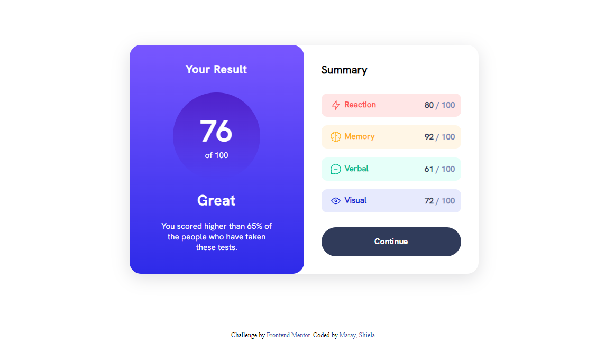

# Frontend Mentor - Results summary component solution

This is a solution to the [Results summary component challenge on Frontend Mentor](https://www.frontendmentor.io/challenges/results-summary-component-CE_K6s0maV). Frontend Mentor challenges help you improve your coding skills by building realistic projects. 

## Table of contents

- [Overview](#overview)
  - [The challenge](#the-challenge)
  - [Screenshot](#screenshot)
  - [Links](#links)
- [My process](#my-process)
  - [Built with](#built-with)
  - [What I learned](#what-i-learned)
  - [Continued development](#continued-development)
  - [Useful resources](#useful-resources)
- [Author](#author)
- [Acknowledgments](#acknowledgments)

**Note: Delete this note and update the table of contents based on what sections you keep.**

## Overview

### The challenge

Users should be able to:

- View the optimal layout for the interface depending on their device's screen size
- See hover and focus states for all interactive elements on the page
- **Bonus**: Use the local JSON data to dynamically populate the content

### Screenshot

Add a screenshot of your solution. The easiest way to do this is to use Firefox to view your project, right-click the page and select "Take a Screenshot". You can choose either a full-height screenshot or a cropped one based on how long the page is. If it's very long, it might be best to crop it.

Alternatively, you can use a tool like [FireShot](https://getfireshot.com/) to take the screenshot. FireShot has a free option, so you don't need to purchase it. 

Then crop/optimize/edit your image however you like, add it to your project, and update the file path in the image above.

**Note: Delete this note and the paragraphs above when you add your screenshot. If you prefer not to add a screenshot, feel free to remove this entire section.**

### Links

- Live Site URL: (https://marayshiela.github.io/results-summary-component-main/)

## My process
  I just followed the suggested workflow on the readme which was really helpful.

### Built with

- Semantic HTML5 markup
- CSS custom properties
- Flexbox
- CSS Grid
- Mobile-first workflow

### What I learned

This challenge taught me the importance of mastering website layout.  The most important thing that I believe a beginner should master is flexbox and grid to ensure the responsive design of the app or website.

### Continued development

I'm planning to master the website layout and the use of different html and CSS elements like creating drop shadow, gradient and CSS specificity.

### Useful resources

- [CSS guide to Flexbox]([https://www.example.com](https://css-tricks.com/snippets/css/a-guide-to-flexbox/)) - Very helpful illustrations in creating layout
- [CSS guide to Grid]([https://www.example.com](https://css-tricks.com/snippets/css/complete-guide-grid/)) - Very helpful illustrations in creating layout

## Author

- Website - [Shiela Maray](https://marayshiela-va.online)
- Frontend Mentor - [@marayshiela](https://www.frontendmentor.io/profile/marayshiela)

## Acknowledgments

I just want to say thank you to Frontend Mentor. I enjoyed doing the challenge and I learned a lot
